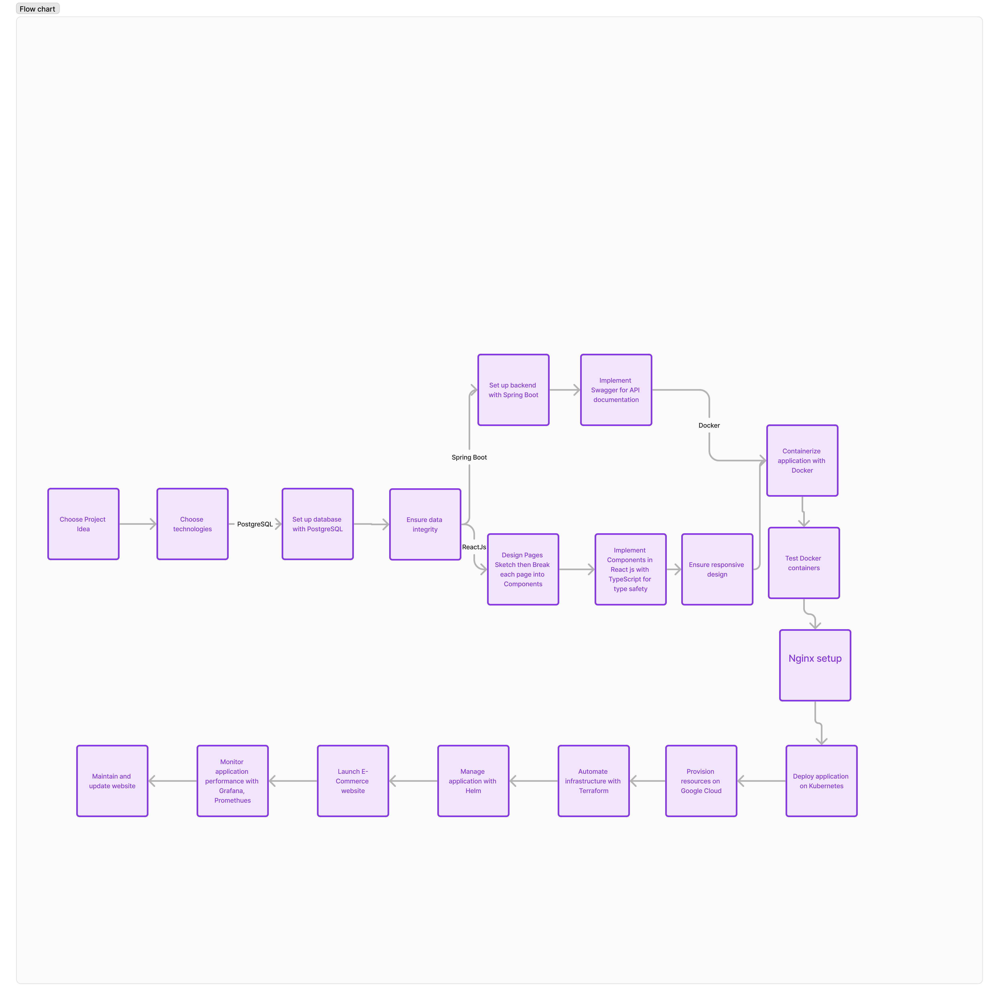

# E-Commerce-Website

## Workflow

# Requirements

## Use Cases
Customer: 
Account Management:
Update profile information (name, address, etc.)
Change password
View order history
Manage payment methods

Register, login, browse products, view product details, add to cart, checkout, track order.
Owner: 
Login,  , Register Admins, Remove Admins
Admins:
Remove content,manage orders, view reports, manage products,